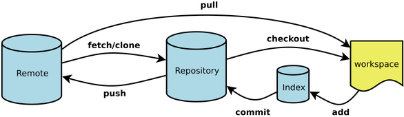

# Git

## 一、来龙去脉
#### [git](https://git-scm.com/)是一个免费的开源分布式版本控制系统，旨在快速高效地处理从小型到大型项目的所有内容。

## 二、常用命令

- Workspace：工作区
- Index / Stage：暂存区
- Repository：仓库区（或本地仓库）
- Remote：远程仓库

 常用命令可以参考阮一峰的博客：[http://www.ruanyifeng.com/blog/2015/12/git-cheat-sheet.html](http://www.ruanyifeng.com/blog/2015/12/git-cheat-sheet.html) 
 

